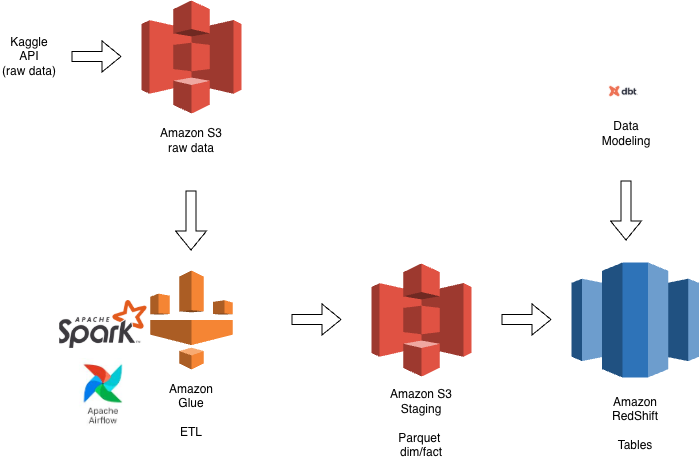

# 🎬 YouTube Trending Analytics Data Warehouse  
### (AWS S3 • Glue • PySpark • Redshift • Airflow • S3)

This project builds an **end-to-end modern data engineering pipeline** that ingests the **YouTube Trending Dataset**, processes it using **AWS Glue (Spark)**, models the data using **dbt**, loads it into **Redshift**, orchestrates workflows with **Airflow**, and visualizes insights using **Tableau**.

---

# 📐 Architecture

Below is the high-level architecture of the project:

---

# 🚀 Project Overview

### **Goal**
To build a complete cloud-native data warehouse & analytics platform for YouTube Trending data using:

- **S3** for raw + staging storage  
- **AWS Glue (Spark)** for ETL  
- **Redshift Serverless** for warehousing  
- **dbt** for data modeling & tests  
- **Airflow** for orchestration  

---

# 📦 Dataset

**Kaggle: YouTube Trending Video Dataset**  
📎 https://www.kaggle.com/datasets/datasnaek/youtube-new

Includes ~400,000 records of trending YouTube videos across multiple countries:

- Video metadata  
- Channel info  
- Category  
- Engagement metrics (views, likes, comments, etc.)  
- Trending date per country  

---

# 🗄️ Data Warehouse Design (Star Schema)

### 🌟 **Dimensions**

| Table | Description |
|-------|-------------|
| `dim_video` | Video metadata (title, tags, publish time, etc.) |
| `dim_channel` | Channel metadata (channel ID, title) |
| `dim_category` | YouTube category lookup |
| `dim_country` | Country codes & attributes |

### 📊 **Facts**

| Table | Grain | Description |
|--------|--------|-------------|
| `fact_video_stats` | video_id + trending_date + country | Daily views/likes/comments |
| `fact_engagement` | video_id + trending_date + country | Engagement rates (like_rate, comment_rate) |
| `fact_trending_duration` | video_id + country | How long a video stays trending |

---

# 🧹 ETL Pipeline (AWS Glue + PySpark)

ETL Steps:

1. **Extract**  
   - Download raw CSV from Kaggle API  
   - Upload to S3 `/raw/`  

2. **Transform** (Glue PySpark Jobs)  
   - Clean raw data  
   - Convert CSV → Parquet  
   - Create dim tables  
   - Create fact tables  
   - Write outputs to S3 `/staging/`  

3. **Load**  
   - Use Redshift `COPY` command to load Parquet from S3  
   - Populate base warehouse schema  

All ETL scripts live in:  
